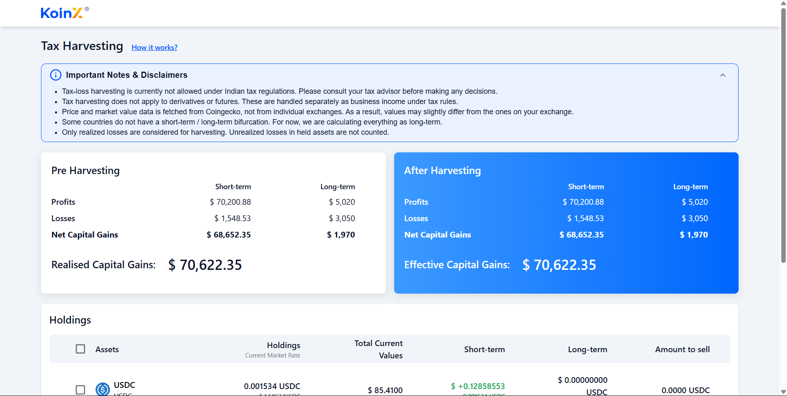
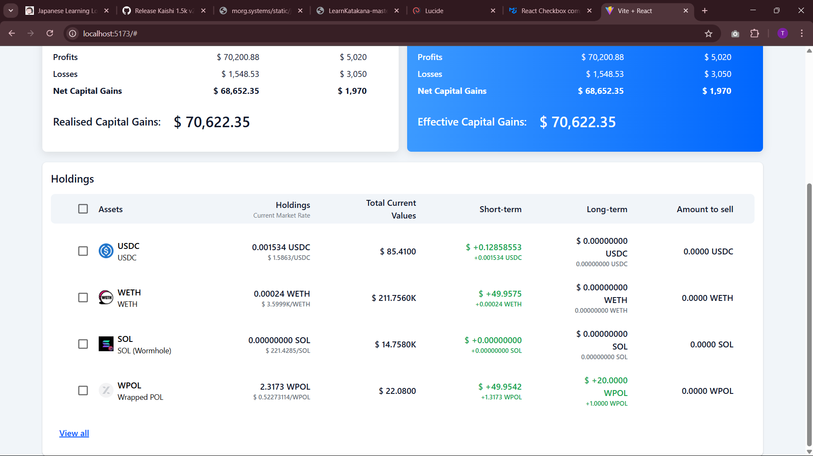
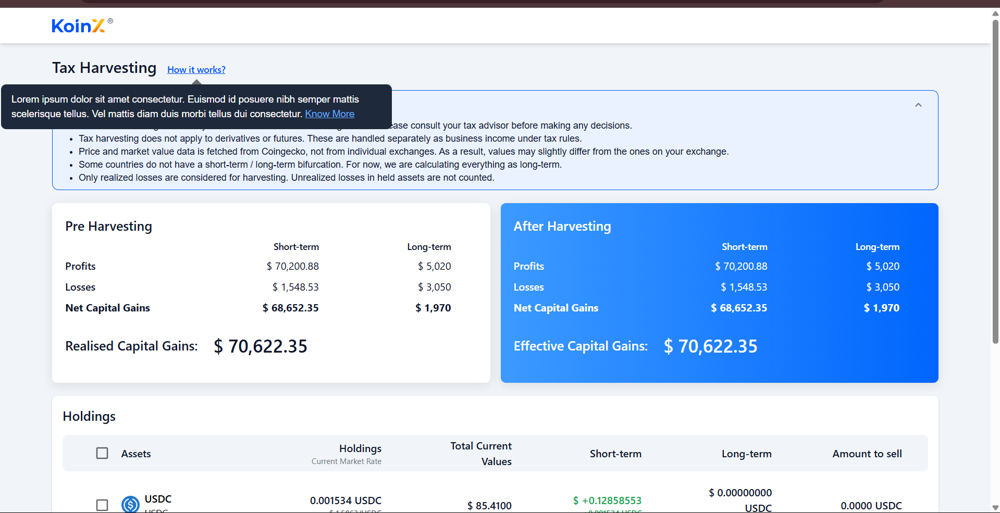

# Tax-loss Harvesting App

A modern React app for simulating tax-loss harvesting, with real-time capital gains calculations, interactive holdings table, and beautiful UI.

---

## 🚀 Setup Instructions

1. **Clone the repository:**
   ```powershell
   git clone <your-repo-url>
   cd Tax-loss-Harvesting
   ```

2. **Install dependencies:**
   ```powershell
   npm install
   ```

3. **Start the development server:**
   ```powershell
   npm run dev
   ```
   The app will be available at [http://localhost:5173](http://localhost:5173) by default.

    Hosted app link: []
---

## 🖼️ Screenshots

### Main App Screen



### Holdings Table


#### Holdings Table Video Demo
<video src="./Tax-loss-Harvesting/public/holdings-video.mp4" controls width="600">Your browser does not support the video tag.</video>

### Tooltip Example



## 📝 Assumptions

- The app uses mock data from `src/apis/holding.json` and `src/apis/capitalGains.json`.
- All calculations are for simulation/demo purposes only and do not constitute tax advice.
- "How it works?" tooltip and alert notes are for user education and may be customized.
- The app assumes each holding has a unique `coin` symbol as its identifier.
- The UI is optimized for desktop and modern browsers.
